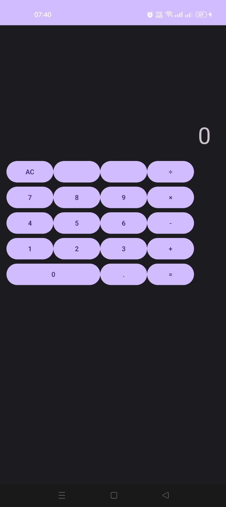
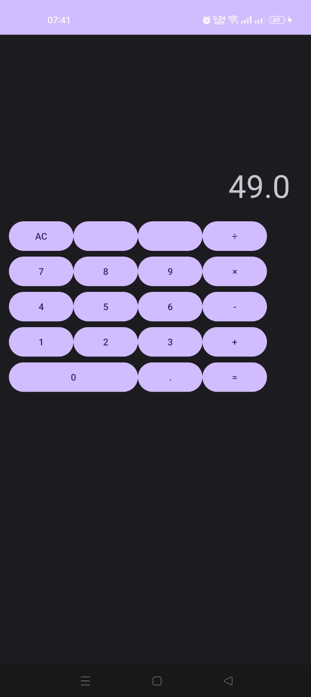

# 📱 Android Calculator App

A simple calculator application built using **Kotlin** and **XML**, developed as part of my Virtual Internship at **Syntecxhub**.

---

## ✨ Features

- ➕ Addition  
- ➖ Subtraction  
- ✖️ Multiplication  
- ➗ Division  
- 🧹 AC (All Clear) button  
- ⚠️ Divide-by-zero protection  

---

## 🛠️ Built With

- 🧑‍💻 Kotlin  
- 🧰 Android Studio  
- 🧩 XML Layout  

---

## 📸 Screenshots

